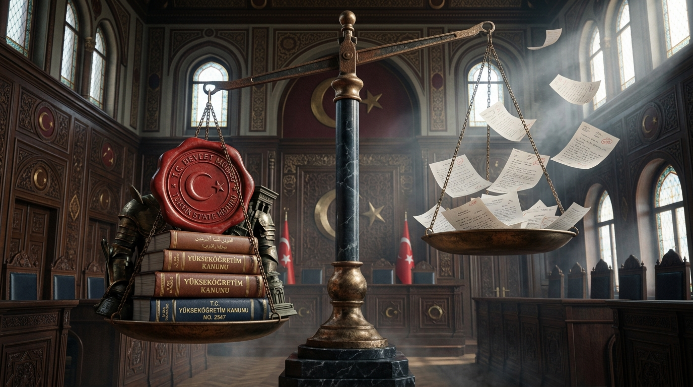
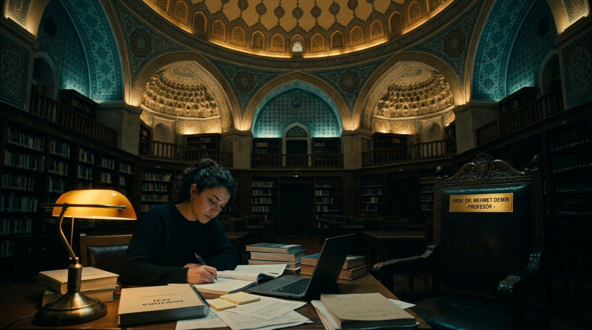
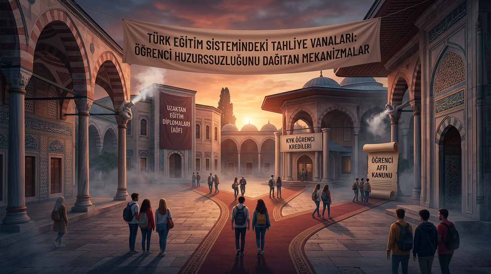
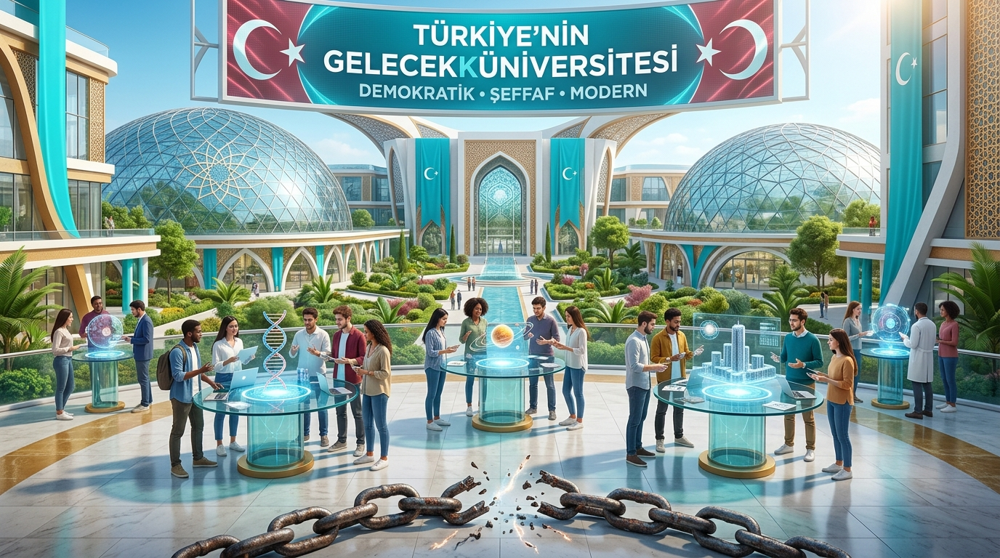

<div align="center">

# Akademik Feodalizm ve Güç Asimetrisi
### Türkiye Yükseköğretiminde Yapısal Çöküş, Kuramsal Analiz ve Demokratik Üniversite Manifestosu

[](https://github.com/arch-yunus/akademik-feodalizm/actions/workflows/validate.yml)
[](LICENSE)
[](index.html)
[](RAPOR_2026.md)

<br/>


<br/>

> *"Bir kurumda denetim ve hesap verebilirlik mekanizmaları ortadan kalktığında, oradaki bilgi üretimi kaçınılmaz olarak yerini feodal bir sadakat, biat ve tahakküm hiyerarşisine bırakır."*

</div>

---

## 📑 İçindekiler Tablosu

1. [Genel Bakış ve Problem Tanımı](#-genel-bakış-ve-problem-tanımı)
2. [Tarihsel Kökenler: Medreselerden 1981 YÖK Rejimine](#-tarihsel-kökenler-medreselerden-1981-yök-rejimine)
3. [Genişletilmiş Düşünürler Arşivi (18 Filozof & Sosyolog)](#-genişletilmiş-düşünürler-arşivi)
4. [Tersine Doğal Seçilim: Kimler Eleniyor ve Türkiye Ne Kaybediyor?](#-tersine-doğal-seçilim-bu-sistemde-kimler-eleniyor-ve-türkiye-ne-kaybediyor)
5. [Akademik Feodalizmin 10 Yapısal Belirtisi](#-akademik-feodalizmin-10-yapısal-belirtisi)
6. [Sorunun Anatomisi: 6 Yapısal Boyut](#-sorunun-anatomisi-6-yapısal-boyut)
7. [Asistanlık Sistemi ve 50/d Kadro Şantajı](#-asistanlık-sistemi-ve-50d-kadro-şantajı)
8. [Sosyal Emniyet Sübvansiyonları (Tahliye Vanaları): "Taş Olsa Çatlardı"](#-sosyal-emniyet-sübvansiyonları-tahliye-vanaları-taş-olsa-çatlardı)
9. [Karşılaştırmalı Yükseköğretim Güç Matrisi](#-karşılaştırmalı-yükseköğretim-güç-matrisi)
10. [En İyi Sistem Hangi Ülkede ve Nasıl Sağladılar? (Hollanda & İskandinavya Modeli)](#-en-iyi-sistem-hangi-ülkede-ve-nasıl-sağladılar)
11. [Bütüncül Reform Paketi ve Somut Yasa Taslağı Önerisi](#-bütüncül-reform-paketi-ve-somut-yasa-taslağı-önerisi)
12. [Hak Arama, Direnç ve Belgeleme Stratejileri](#-hak-arama-direnç-ve-belgeleme-stratejileri)
13. [Dilekçe Şablonları ve Hak Arama Kütüphanesi](#-dilekçe-şablonları-ve-hak-arama-kütüphanesi)
14. [Dizin Yapısı ve Belge Kütüphanesi](#-dizin-yapısı-ve-belge-kütüphanesi)
15. [Veri Doğrulama ve Yerel Portal Çalıştırma](#-veri-doğrulama-ve-yerel-portal-çalıştırma)
16. [Katkıda Bulunma ve Lisans](#-katkıda-bulunma-ve-lisans)

---

## 🌐 İnteraktif Veri, Test ve Analiz Portalı

Bu depoda yer alan analitik araçları, risk testini ve dilekçe üreticisini kullanmak için **[`index.html`](index.html)** portalını ziyaret edebilirsiniz:

- **Fakülte Feodalizm Risk Testi:** Bölümünüzdeki mobbing ve feodalizm riskini hesaplayan 5 soruluk interaktif simülatör.
- **Canlı Dilekçe Taslağı Üretici:** Sınav kâğıdı, barem inceleme ve bağımsız dış jüri talebi için anında dilekçe oluşturma.
- **Karşılaştırmalı Ülke Radarı:** Türkiye, ABD, Almanya, İngiltere, Hollanda, İskandinavya, Japonya ve Fransa modelleri.
- **Trend Grafikleri:** 2018–2025 şikâyet, takipsizlik ve AÖF sığınma oranları.

---

## 🔍 Genel Bakış ve Problem Tanımı

Modern üniversite ideali, Aydınlanma'dan bu yana **hakikatin arandığı, eleştirel aklın işletildiği, unvan ve statüden bağımsız argümanların çarpıştığı özgür bir kamusal alan** olarak tasavvur edilmiştir. Ancak günümüz Türkiye yükseköğretim sisteminde ve benzeri otoriter/bürokratik yapılarda üniversite; orta çağ lonca ve derebeylik düzeninin modern kanun maddeleriyle (2547 ve 657) tahkim edilmiş bir versiyonuna dönüşmüştür.

### Temel Kriz Göstergeleri:
* **Ölçme ve Değerlendirmede Mutlak Keyfiyet:** Sınav kâğıtlarının nesnel baremler olmaksızın, keyfi biçimde notlandırılması ve öğrencinin kendi kâğıdını inceleme hakkının "hocalık onuru" bahanesiyle engellenmesi.
* **%93.4'lük İdari Cezasızlık Oranı:** Yapılan öğrenci şikâyetlerinin aynı fakültedeki meslektaşlardan oluşan kurullara havale edilmesi sonucu sistematik olarak örtbas edilmesi.
* **Akademik Angarya ve Hayalet Yazarlık:** Lisansüstü öğrencilerin ve genç araştırmacıların emeğinin, tezlerinin ve makalelerinin kürsü sahipleri tarafından zorla gasp edilmesi (*coercive / gift authorship*).
* **50/d Kadro Güvencesizliği:** Araştırma görevlilerinin iş güvencesizliği tehdidiyle şahsi hizmetkârlığa mahkûm edilmesi.
* **Sistemsel Emniyet Vanaları ile Öfke Sönümleme:** Haksızlığa uğrayan öğrencinin hakkını aramak yerine Açıköğretim (AÖF), af kanunları veya sessiz terk mekanizmalarıyla sistem dışına itilmesi.

---

## 🏛️ Tarihsel Kökenler: Medreselerden 1981 YÖK Rejimine

Akademideki güç tekelini anlamak için kurumun tarihsel evrimini iki ana eksende incelemek gerekir:

### 1. Lonca ve İcazet Geleneği
İlk Avrupa üniversiteleri ve geleneksel medreseler, usta-çırak ilişkisi üzerine kurulu lonca yapılarıydı (*universitas magistrorum et scholarium*). Bu yapıda üstat (müderris/doktor), mesleğe kimin kabul edileceğine tek başına karar verirdi. Batı akademisi zamanla bu lonca tekelini bağımsız kurullar, çift körleme sınav komisyonları ve öğrenci meclisleriyle demokratikleştirirken; Türkiye yükseköğretimi loncanın **keyfi icazet ve sadakat** kültürünü bürokratik devlet güvencesiyle birleştirmiştir.

### 2. 12 Eylül 1980 Askeri Darbesi ve 2547 Sayılı YÖK Kanunu
Türkiye'de akademik feodalizmin modern yasal altyapısı, 1981 yılında yürürlüğe giren **2547 Sayılı Yükseköğretim Kanunu** ile kurulmuştur:
* **Merkeziyetçi Kışla Modeli:** Üniversite özerkliği ve fakülte kurullarının yetkileri budanarak tüm yetki tek adama (Rektör ve Dekan) devredilmiştir.
* **Ceza Dokunulmazlığı (Madde 53/C):** Akademisyenlerin öğrencilere karşı işledikleri fiiller doğrudan adli yargı denetiminden kaçırılarak üniversite yönetiminin "iznine" (*men-i muhakeme*) bağlanmıştır.
* **Demokratik Öğrenci Temsilinin Tasfiyesi:** Öğrencilerin üniversite senatosu ve fakülte yönetim kurullarındaki karar ve oy hakları tamamen sıfırlanmıştır.

---

## 📖 Genişletilmiş Düşünürler Arşivi (18 Filozof & Sosyolog)

```text
┌──────────────────────────────────────────────────────────────────────────────────┐
│                           KURAMSAL PERSPEKTİF MATRİSİ                            │
├───────────────────────┬──────────────────────────┬───────────────────────────────┤
│ DÜŞÜNÜR               │ ESER                     │ TEMEL KAVRAM / ELEŞTİRİ       │
├───────────────────────┼──────────────────────────┼───────────────────────────────┤
│ Max Weber             │ Bürokrasi ve Otorite     │ Bürokratik Kast Zırhı         │
│ Immanuel Kant         │ Aydınlanma Nedir?        │ Kendi Aklını Kullanma Korkusu │
│ Arthur Schopenhauer   │ Üniversite Felsefesi     │ Kürsü Tüccarlığı & Hakikat Boğma│
│ Jürgen Habermas       │ İletişimsel Eylem        │ Tahakkümsüz Kamusal Alan      │
│ Pierre Bourdieu       │ Homo Academicus          │ Simgesel Şiddet & Akademik Kast│
│ Michel Foucault       │ Hapishanenin Doğuşu      │ Kapalı Devre Gözetim & Disiplin│
│ Paulo Freire          │ Ezilenlerin Pedagojisi   │ Bankacı Eğitim & Gardiyanlık  │
│ Antonio Gramsci       │ Hapishane Defterleri     │ Hegemonya & Geleneksel Aydın  │
│ Edward Said           │ Entelektüel              │ Mikro-Alanda Despotlaşma      │
│ Karl Marx             │ Yabancılaşma El Yazmaları│ Akademik Emeğin Gaspı         │
│ Friedrich Nietzsche   │ Eğitim Kurumları Üzerine │ Memur Yetiştirme Fabrikası    │
│ Baruch Spinoza        │ Tractatus Theologico     │ Düşünce Özgürlüğünün Gaspı    │
│ Jacques Derrida       │ Koşulsuz Üniversite      │ Şartsız Sorgulama Hakkı       │
│ Jean-François Lyotard │ Postmodern Durum         │ Performativite & İktidar Yozlaşması│
│ Noam Chomsky          │ Rızanın İmalatı          │ İtaatkar Entelektüel Üretimi  │
│ Ivan Illich           │ Okulsuz Toplum           │ Diplomanın İtaat Belgesi Oluşu│
│ Byung-Chul Han        │ Psikopolitika            │ İçselleştirilmiş Şiddet/Tükeniş│
│ Korkut Boratav        │ Üniversite ve Aydınlar   │ Darbe Rejimi & Memurlaşma     │
└───────────────────────┴──────────────────────────┴───────────────────────────────┘
```

Ayrıntılı felsefi ve sosyolojik metinler için [`alintilar-ve-dokumanlar/burokratik-tahakkum-literaturu.md`](alintilar-ve-dokumanlar/burokratik-tahakkum-literaturu.md) dosyasını inceleyebilirsiniz.

---

## 🎯 "Tersine Doğal Seçilim": Bu Sistemde Kimler Eleniyor ve Türkiye Ne Kaybediyor?

Akademik feodalizm ve kürsü derebeyliği, iddia edildiği gibi tembel veya yetersiz olanı değil; **tam aksine ülkenin en parlak, en bağımsız ve en onurlu zihinlerini sistemli olarak tasfiye eder**:

```text
┌──────────────────────────────────────────────────────────────────────────────────┐
│                   AKADEMİK FEODALİZMİN TASFİYE MEKANİZMASI                       │
├──────────────────────────────────────┬───────────────────────────────────────────┤
│ ELENEN ÖĞRENCİ / ARAŞTIRMACI PROFİLİ │ KÜRSÜNÜN TEPKİSİ VE TASFİYE GEREKÇESİ     │
├──────────────────────────────────────┼───────────────────────────────────────────┤
│ 1. Eleştirel ve Güncel Zekâ          │ "Hocalık onuruna tehdit / Ukalalık"       │
│ 2. Kişisel Onur ve Özsaygı (Biat Yok)│ "Hocasına hizmet etmeyen kapı kulu olmaz" │
│ 3. Gerçek Bilim Üreticisi            │ "Makaleme adımı yazmıyorsan kadro yok"    │
│ 4. Hak Arayan ve Şeffaflık İsteyen   │ "Kurumu karıştıran / Uyumsuz anarşist"    │
└──────────────────────────────────────┴───────────────────────────────────────────┘
```

> "Türkiye'de üniversiteler bilim üretmek için değil; unvan sahiplerinin kendi feodal beyliklerini koruması için dizayn edilmiştir. Gerçek bir dâhi veya parlak bir genç bu sisteme girdiğinde, ilk iş olarak onun sivriliklerini budarlar; budayamazlarsa sistemin dışına fırlatıp atarlar."
> — **Prof. Dr. Oktay Sinanoğlu**

> "Bana Amerika'da neden kaldığımı soruyorlar. Çünkü orada bana 'Sen kimsin, hocana nasıl karşı çıkarsın?' demediler; 'Ne buldun, teorin ne?' dediler. Liyakat ve dürüstlük olmayan bir yerde bilim yeşermez; sadece dalkavukluk yeşerir."
> — **Prof. Dr. Aziz Sancar**

### Türkiye'nin Ağır Milli Kaybı:
1. **Beşerî Sermaye İflası ve Beyin Göçü:** Milletin vergileriyle dereceyle yetiştirilmiş en parlak dimağlar küstürülerek Almanya (Max Planck), Hollanda (TU Delft), İsviçre (ETH) veya ABD'ye kaçar; Türkiye kendi milli servetini Batı'ya hibe eder.
2. **"Vasatın Diktatörlüğü":** Koltuğunu korumak isteyen vasat akademisyen kendisinden daha zeki kimseyi içeri almaz; üniversiteler her nesilde biraz daha vasatlaşarak dünya ilk 500'ünden silinir.
3. **Stratejik Teknolojide Dışa Bağımlılık:** Özgür ve yetenekli araştırmacılar tasfiye edildiği için savunma, yapay zekâ ve biyoteknolojide bağımsız bilim üretimi felç olur.

Ayrıntılı monograf için: [`analizler/09_elenenlerin-anatomisi-ve-milli-kayip.md`](analizler/09_elenenlerin-anatomisi-ve-milli-kayip.md).

---

## 🚩 Akademik Feodalizmin 10 Yapısal Belirtisi

Bir üniversite veya fakültenin ne derece feodal bir yapıya teslim olduğunu gösteren **10 Tanı Kriteri**:

1. **Baremsiz ve Kapalı Sınav Sistemi:** Soruların puanlama kriterleri ilan edilmez; öğrenciye kendi kâğıdı inceletilmez.
2. **Kişiye Özel Kadro İlanları:** İlan şartları doğrudan kürsü hocasının asistanının tez başlığına göre yazılır.
3. **Zoraki ve Hayalet Yazarlık (*Gift/Coercive Authorship*):** Hocanın adının asistanın ve öğrencinin makalelerine zorla birinci yazar yapılması.
4. **Fakülte İçi Ön İnceleme Tiyatrosu:** Şikâyet edilen hocanın aynı çay odasını paylaştığı mesai arkadaşı tarafından aklanması.
5. **Kişisel Hizmet ve Angarya:** Lisansüstü öğrencilerin hocanın şahsi işleri, özel projeleri veya evrak hamallığı için kullanılması.
6. **Sözlü Sınavlarda Kayıt Tutulmaması:** Mülakat, jüri ve yeterlik sınavlarının ses/video kaydı olmaksızın keyfiyetle yapılması.
7. **Misilleme Tehdidi (*Retaliation*):** Hakkını arayan öğrenciye "dersi geçemezsin, mezun olamazsın" şantajı uygulanması.
8. **Öğrenci Temsilinin Sıfırlanması:** Fakülte ve üniversite yönetim kurullarında öğrencinin oy ve söz hakkının bulunmaması.
9. **Kürsüde Mutlak İtaat Dili:** Akademik eleştirinin "hocalık makamına saygısızlık" olarak kriminalize edilmesi.
10. **Sessiz Terk ve Beyin Göçü:** Başarılı gençlerin hak aramak yerine bölüm değiştirmesi, açıköğretime kaçması veya yurtdışına gitmesi.

---

## 🧬 Sorunun Anatomisi: 6 Yapısal Boyut

<div align="center">



</div>

1. **Hukuki ve İdari Dokunulmazlık Zırhı:** 2547 s.K. m. 53/C (*men-i muhakeme*) ve 657 ile sağlanan yargısal dokunulmazlık. ([Detaylı Analiz 02](analizler/02_turkiyede-2547-zirhi-ve-cezasizlik.md))
2. **Ölçme ve Değerlendirmede Mutlak Keyfiyet:** Baremsiz sınavlar ve itirazın kâğıdı okuyan aynı hocaya gönderilmesi açmazı.
3. **Kapalı Devre Soruşturma:** %93.4'lük meslektaş aklama ve cezasızlık oranı. ([İstatistiksel Rapor](RAPOR_2026.md))
4. **Akademik Angarya ve Hayalet Yazarlık:** 50/d kadro şantajı ve genç akademisyen sömürüsü. ([Detaylı Analiz 07](analizler/07_asistanlik-ve-arastirma-gorevlisi-somurusu.md))
5. **Psikolojik Şiddet ve Öğrenilmiş Çaresizlik:** *Gaslighting*, akademik depresyon ve intihar vakaları. ([Detaylı Analiz 05](analizler/05_psikopolitika-ve-ogrenilmis-caresizlik.md))
6. **Sosyal Emniyet Sübvansiyonları (Tahliye Vanaları):** AÖF, periyodik aflar ve KYK ile öfke sönümleme. ([Detaylı Analiz 03](analizler/03_sosyal-tahliye-vanalari-aof-ve-kyk.md))

---

## 🔬 Asistanlık Sistemi ve 50/d Kadro Şantajı

<div align="center">



</div>

2547 Sayılı Kanun'un **50/d maddesi**, lisansüstü eğitim gören araştırma görevlilerini güvencesiz ve geçici sözleşmelere mahkûm ederek kürsü başkanlarının şahsi hizmetkârına dönüştürmüştür. Doktora bittiğinde işsiz kalma korkusu yaşayan genç akademisyen:
* Hocanın şahsi angaryalarını ve evrak hamallığını yapmak zorunda kalır.
* Kendi yazdığı makalelere hocanın adını zorla birinci yazar olarak ekler (*gift/coercive authorship*).
* Ayrıntılı analiz için: [`analizler/07_asistanlik-ve-arastirma-gorevlisi-somurusu.md`](analizler/07_asistanlik-ve-arastirma-gorevlisi-somurusu.md).

---

## 🚪 Sosyal Emniyet Sübvansiyonları (Tahliye Vanaları): "Taş Olsa Çatlardı"

<div align="center">



</div>

> *"Bir sistemde hiyerarşi bu kadar katı, denetimsizlik bu kadar mutlak ve mobbing bu kadar pervasızsa; normalde taş olsa çatlardı, kampüslerde her dönem büyük toplumsal patlamalar ve boykotlar yaşanırdı. Peki neden yaşanmıyor?"*

Türkiye yükseköğretim sisteminde yaşanan ağır mobbing ve haksızlıklara rağmen kitlesel bir isyanın doğmamasının sırrı; devletin ve sistemin inşa ettiği **"4 Büyük Emniyet / Tahliye Vanası"**nda gizlidir. Devlet, kürsünün zorbalığını denetlemez; ancak kurbanın patlama noktasına gelen öfkesini ustalıkla dağıtan kaçış kapıları sunar:

```text
       ┌─────────────────────────────────────────────────────────────────┐
       │   AKADEMİK BASKI, KEYFİ NOT & AĞIR MOBBİNG ("Taş Olsa Çatlardı") │
       └────────────────────────────────┬────────────────────────────────┘
                                        │
                                        ▼
       ┌─────────────────────────────────────────────────────────────────┐
       │                SİSTEMİN 4 BÜYÜK TAHLİYE VANASI                  │
       ├─────────────────────────────────────────────────────────────────┤
       │ 1. AÖF & AUZEF      ──► Hocasız, İntikamsız Diploma & Tecil     │
       │ 2. Kesintisiz KYK   ──► Kredi & Yurt Hakkının Sürmesi (Tampon)  │
       │ 3. Ek Madde 1       ──► Hocayla Muhatap Olmadan Sessiz Firar    │
       │ 4. Periyodik Aflar  ──► "Nasılsa Af Çıkar" Uyuşturucusu         │
       └────────────────────────────────┬────────────────────────────────┘
                                        │
                                        ▼
       ┌─────────────────────────────────────────────────────────────────┐
       │          SONUÇ: BİREYSELLEŞMİŞ, SÖNÜMLENMİŞ VE ATOMİZE ÖFKE     │
       │            Sıfır Kurumsal Çatışma • Sessizce Terk               │
       └─────────────────────────────────────────────────────────────────┘
```

1. **Açıköğretim (AÖF & AUZEF) Kaçışı:** Örgün fakültede hocanın kaprisiyle mezuniyeti engellenen ve askerlik tehlikesiyle karşılaşan öğrenci; tek tıkla AÖF'e kaydolarak bilgisayarın okuduğu çoktan seçmeli sınavlarla diplomasını ve tecilini alır. Hocayla savaşmak yerine hocasız sisteme kaçar.
2. **KYK Kredisi ve Yurt Hakkının Kesilmemesi (Maddi Açlık Tamponu):** Öğrenci dersten kalsa, dönem uzatsa dahi KYK kredisi ve devlet yurdu hakkı kesilmez. Bu durum öğrencinin sokakta aç ve evsiz kalmasını önleyerek hayatta kalma krizinin sokak eylemine dönüşmesini engeller.
3. **Ek Madde 1 ile Merkezi Yatay Geçiş:** Hocasıyla kanlı bıçaklı olan öğrenci, hocanın veya dekanlığın iznine gerek duymaksızın üniversiteye giriş puanıyla başka bir şehre sessizce kaçabilir. Çatışma kurumsal bir hesap sormaya dönüşmeden coğrafi olarak ötelenir.
4. **Periyodik Öğrenci Afları:** 3-4 yılda bir çıkarılan genel öğrenci afları, mağdurun zihninde *"nasılsa af çıkar, diplomamı alırım"* rehaveti yaratarak organize bir adalet arayışını ve kolektif öfkeyi zamana yayarak eritir.

Ayrıntılı kuramsal inceleme için: [`analizler/03_sosyal-tahliye-vanalari-aof-ve-kyk.md`](analizler/03_sosyal-tahliye-vanalari-aof-ve-kyk.md).

---

## ⚖️ Karşılaştırmalı Yükseköğretim Güç Matrisi

| Ülke / Model | Hukuki Statü & İş Güvencesi | Güç Asimetrisi Skoru (1-10) | Şikâyet & Denetim Mekanizması | Cezasızlık Oranı (%) | Öfke / Gerilim Tahliye Vanaları |
| :--- | :--- | :--- | :--- | :--- | :--- |
| **Türkiye (2547 Modeli)** | **657 & 2547 Memur Zırhı:** Yetersizlikten görevden alma imkânsız. | **9.2 / 10** (Aşırı Yüksek) | **Kapalı Devre:** Fakülte içi meslektaş ataması; harici ombudsman yok. | **%93.4** | **Yüksek:** AÖF, periyodik aflar, kesintisiz KYK kredisi. |
| **Hollanda & İskandinavya** | **Demokratik Kamu Sözleşmesi:** Şeffaf liyakat ve hesap verebilirlik. | **1.5 / 10** (Yatay ve Eşitlikçi) | **Ulusal Bağımsız Ombudsman & Sınav Temyiz Kurulu (CBE):** Dış yargıç denetimi. | **%6.8** | **Gereksiz:** Sistem şeffaf ve adil işlediği için yapay vanalara ihtiyaç yok. |
| **Almanya (Kıta Avrupası)** | **Beamte (Devlet Memuru):** W2/W3 Profesörlük, idari özerklik. | **6.2 / 10** (Orta Düzey) | **Zweitprüfer & İdare Yargısı:** Çift okuyucu zorunlu; İdare Mahkemesi not düzeltir. | **%45.2** | **Yüksek:** Harçsız kamu eğitimi, BAföG desteği, serbest üniversite geçişi. |
| **Birleşik Krallık (Regüle Piyasa)** | **Sözleşmeli Akademik Kadro:** 1988'de tenure kaldırıldı; REF/TEF odaklı. | **4.0 / 10** (Düşük) | **External Examiner & OIAHE:** Sınavlar dış hakem onaylı; bağımsız hakem ofisi. | **%29.5** | **Orta:** Gelire endeksli kredi; modül tamamlama esnekliği. |
| **ABD (Piyasa/Tenure)** | **Tenure vs. Adjunct:** Kutuplu istihdam; kadrolu korunaklı, sözleşmeli güvencesiz. | **4.5 / 10** (Orta-Düşük) | **Ombuds Office & Federal Dava:** Title IX soruşturması, sivil tazminat davaları. | **%38.0** | **Çok Düşük:** Silinemez öğrenci kredisi borçları; okuldan atılma iflas demektir. |
| **Japonya (Koza Modeli)** | **Ulusal Üniversite Statüsü:** Fiili ömür boyu istihdam geleneği. | **8.6 / 10** (Yüksek) | **Pawa-Hara Masaları:** Şikâyet masaları var ancak sosyal baskı nedeniyle atıl. | **%81.0** | **Orta:** Kurumsal işe alım döngüsü (Shinsotsu); akademik alanı sessizce terk. |

---

## 🏆 En İyi Sistem Hangi Ülkede ve Nasıl Sağladılar?

Dünya genelinde akademik özgürlük ile öğrenci haklarını en kusursuz dengeleyen yapı **Hollanda ve İskandinav Ülkeleri (Danimarka, İsveç, Norveç, Finlandiya)** modelidir.

1. **Danimarka Yükseköğretim Ombudsmanlığı (*Uddannelsesombudsmanden*):** Rektör ve dekanlardan bağımsız, öğrenci şikâyetlerinde hocayı doğrudan görevden alabilen Ulusal Ombudsmanlık.
2. **Hollanda CBE Sistemi (*College van Beroep voor de Examens*):** Yargıç ve bağımsız akademisyenlerden oluşan, hocanın not takdirini resen iptal edip notu düzelten Sınav Temyiz Kurulu.
3. **İsveç HAN Kurulu (*Högskolans Avskiljande Nämnd*):** Meslektaş dayanışmasını engellemek için yüksek yargıç başkanlığında çalışan Ulusal İhraç Kurulu.
4. **Çift Körleme & İsimsiz Sınav (*Double-Blind Grading*):** Sınavlarda karekod kullanımı ve iki bağımsız değerlendirici zorunluluğu.

Ayrıntılı inceleme için [`mevzuat-arsivi/nl-dk-ombudsmanlik-ve-cbe-mevzuati.md`](mevzuat-arsivi/nl-dk-ombudsmanlik-ve-cbe-mevzuati.md) sayfasına bakabilirsiniz.

---

## 🛠️ Bütüncül Reform Paketi ve Somut Yasa Taslağı Önerisi

<div align="center">



</div>

Türkiye yükseköğretim sistemindeki feodal tahakkümü sona erdirmek için hazırlanan **5 Maddelik Kanun Teklifi**:

1. **Madde 1:** İsimsiz sınav (karekod) ve 24 saat içinde dijital barem ilan zorunluluğu.
2. **Madde 2:** Sınav itirazlarının kâğıdı okuyan hocaya değil, 3 kişilik dış bağımsız hakem heyetine verilmesi.
3. **Madde 3:** 2547 sayılı Kanun Madde 53/C'nin (*Men-i Muhakeme*) kaldırılarak doğrudan genel savcılık yolunun açılması.
4. **Madde 4:** TBMM Kamu Denetçiliği bünyesinde Yükseköğretim Başdenetçiliği ve yasal *Misilleme Yasağı (Anti-Retaliation)* getirilmesi.
5. **Madde 5:** Lisansüstü tez yayınlarında öğrencinin birinci isim hakkı ve hayalet yazarlık yapan hocanın intihalden unvanının alınması.

Kanun gerekçeleri ve tam metin için: [`analizler/06_kapsamli-reform-ve-yasa-taslagi-onerisi.md`](analizler/06_kapsamli-reform-ve-yasa-taslagi-onerisi.md).

---

## 🛡️ Hak Arama, Direnç ve Belgeleme Stratejileri

Akademik mobbinge veya haksızlığa uğrayan bir öğrenci/araştırmacının izlemesi gereken **5 Adımlı Savunma Rehberi**:

```text
[1. Dijital Belgeleme] ──► [2. Resmi İtiraz] ──► [3. İdare Mahkemesi] ──► [4. KDK / Ombudsman] ──► [5. Savcılık]
 (E-posta, OBS, Baremler)   (Şablon Dilekçeler)   (60 Gün İçinde Dava)     (E-Devlet Başvurusu)      (TCK Suç Duyurusu)
```

1. **Yazılı İletişim İlkesi:** Hocayla yapılan tüm kritik görüşmeleri e-posta üzerinden yürütün ("Bugünkü görüşmemizde belirttiğiniz üzere..." formatında teyit mailleri atın).
2. **Sınav Kâğıdı ve Barem Talep Edin:** Sınav ilanından itibaren ilk 5 gün içinde resmi dilekçeyle ([Şablon 01](dilekce-sablonlari/01_sinav-kagidi-ve-barem-inceleme-talebi.md)) cevap anahtarını ve baremi yazılı isteyin.
3. **60 Günlük İdari Dava Süresini Kaçırmayın:** Fakülte ret yazısının tebliğinden itibaren 60 gün içinde İdare Mahkemesi'nde yürütmeyi durdurma talepli iptal davası açın.
4. **Kamu Denetçiliği Kurumu (KDK) Başvurusu:** E-Devlet üzerinden ücretsiz ve harçsız olarak KDK'ya başvurun; KDK'nın üniversite aleyhine verdiği tavsiye kararlarını mahkemeye delil sunun.
5. **Danışman Şantajında Enstitü Değişimi:** [Şablon 04](dilekce-sablonlari/04_tez-danismani-degisikligi-talep-dilekcesi.md) ile danışman değişikliği dilekçesi vererek süreci yazılı kayda bağlayın.

---

## 📝 Dilekçe Şablonları ve Hak Arama Kütüphanesi

Öğrenciler ve araştırmacılar için hazırlanmış hukuken geçerli resmi dilekçe taslakları:

- 📄 [`01_sinav-kagidi-ve-barem-inceleme-talebi.md`](dilekce-sablonlari/01_sinav-kagidi-ve-barem-inceleme-talebi.md)
- 📄 [`02_bagimsiz-dis-juri-itiraz-dilekcesi.md`](dilekce-sablonlari/02_bagimsiz-dis-juri-itiraz-dilekcesi.md)
- 📄 [`03_akademik-mobbing-ve-gorevi-kotuye-kullanma-sikayeti.md`](dilekce-sablonlari/03_akademik-mobbing-ve-gorevi-kotuye-kullanma-sikayeti.md)
- 📄 [`04_tez-danismani-degisikligi-talep-dilekcesi.md`](dilekce-sablonlari/04_tez-danismani-degisikligi-talep-dilekcesi.md)
- 📄 [`05_savcilik-suc-duyurusu-taslagi.md`](dilekce-sablonlari/05_savcilik-suc-duyurusu-taslagi.md)

---

## 📁 Dizin Yapısı ve Belge Kütüphanesi

```text
├── assets/images/                                    # 5 Adet Yüksek Çözünürlüklü Milli Banner
│   ├── 01-milli-hero-banner.jpg                      # Ana Başlık & İstanbul Üniv. Kapısı Banner'ı
│   ├── 02-milli-guc-asimetrisi-banner.jpg            # Güç Asimetrisi, Terazi & 2547 Zırhı
│   ├── 03-milli-asistan-emek-banner.jpg              # Asistan, 50/d & Emek Gaspı
│   ├── 04-milli-tahliye-vanalari-banner.jpg          # AÖF, KYK & Af Tahliye Vanaları
│   └── 05-milli-demokratik-reform-banner.jpg         # Geleceğin Demokratik Türk Üniversitesi
├── dilekce-sablonlari/                               # Hukuken Geçerli Resmi Dilekçe Şablonları
│   ├── 01_sinav-kagidi-ve-barem-inceleme-talebi.md
│   ├── 02_bagimsiz-dis-juri-itiraz-dilekcesi.md
│   ├── 03_akademik-mobbing-ve-gorevi-kotuye-kullanma-sikayeti.md
│   ├── 04_tez-danismani-degisikligi-talep-dilekcesi.md
│   └── 05_savcilik-suc-duyurusu-taslagi.md
├── index.html                                        # İnteraktif Web Portalı & Risk Testi
├── RAPOR_2026.md                                     # Otomatik İstatistiksel Analitik Rapor
├── KATKI.md                                          # Katkı Kılavuzu ve Araştırma Etiği
├── LICENSE                                           # MIT Lisansı
├── .github/workflows/validate.yml                   # Otomatik Veri Doğrulama CI
├── scripts/
│   ├── generate_report.py                            # Rapor Üretici Betik
│   └── validate_data.py                              # JSON/CSV Doğrulama Betiği
├── veriler/
│   ├── ulke-akademik-mevzuatlari.json                # Karşılaştırmalı ülke parametreleri
│   ├── sorusturma-sonuclari-ve-ihrac-oranlari.csv    # Soruşturma ve cezasızlık istatistikleri
│   ├── ogrenci-terk-ve-af-istatistikleri.csv         # Terk, AÖF ve af verileri
│   └── universite-akademik-mobbing-ve-intihar-kronolojisi.csv # Olay kronolojisi
├── alintilar-ve-dokumanlar/
│   ├── burokratik-tahakkum-literaturu.md             # Kuramsal metinler ve sosyolojik analizler
│   ├── ogrenci-dilekce-ornekleri-ve-akibeti.md        # Anonimleştirilmiş dilekçe vakaları
│   └── emsal-idare-mahkemesi-kararlari.md            # Danıştay ve İdare Mahkemesi içtihatları
├── analizler/
│   ├── 01_kursu-derebeyligi-ve-feodal-iliskiler.md   # Kürsü feodalizminin anatomisi
│   ├── 02_turkiyede-2547-zirhi-ve-cezasizlik.md       # 2547/657 zırhı ve kapalı devre kurullar
│   ├── 03_sosyal-tahliye-vanalari-aof-ve-kyk.md       # Emniyet vanaları ve öfke sönümleme
│   ├── 04_anglosakson-ve-kita-avrupasi-kiyaslamasi.md# Küresel modellerin karşılaştırması
│   ├── 05_psikopolitika-ve-ogrenilmis-caresizlik.md   # Gaslighting, tükenmişlik ve psikolojik şiddet
│   ├── 06_kapsamli-reform-ve-yasa-taslagi-onerisi.md # Somut kanun teklifi maddeleri
│   ├── 07_asistanlik-ve-arastirma-gorevlisi-somurusu.md # 50/d kadro güvencesizliği ve sömürü
│   ├── 08_juri-ve-akademik-yukselme-yozlasmasi.md     # Adrese teslim kadro ve ahbap-çavuş jürileri
│   └── 09_elenenlerin-anatomisi-ve-milli-kayip.md    # Elenen parlak zihinler ve milli maliyet analizi
└── mevzuat-arsivi/
    ├── tr-kanun-2547-ve-disiplin-yonetmelikleri.md   # Türkiye yükseköğretim mevzuatı
    ├── abd-title-ix-ve-ombudsmanlik-yapisi.md        # ABD Title IX, FERPA ve Ombudsmanlık
    ├── de-hochschulrahmengesetz.md                   # Almanya HRG ve Prüfungsrecht
    └── nl-dk-ombudsmanlik-ve-cbe-mevzuati.md         # Hollanda & Danimarka mevzuat arşivi
```

---

## 🧪 Veri Doğrulama ve Yerel Portal Çalıştırma

Veri setlerinin bütünlüğünü ve şema geçerliliğini doğrulamak için:

```bash
python scripts/validate_data.py
```

Rapor üretmek için:

```bash
python scripts/generate_report.py
```

İnteraktif web portalını yerel tarayıcınızda açmak için:

```bash
# Python ile yerel sunucu başlatma
python -m http.server 8000
```
Tarayıcınızda `http://localhost:8000` adresine gidin.

---

## 🤝 Katkıda Bulunma

Ayrıntılı kurallar, veri formatlama şablonları ve araştırma etiği için lütfen [KATKI.md](KATKI.md) dosyasını inceleyiniz.

---

## 📄 Lisans

Bu araştırma projesi [MIT Lisansı](LICENSE) kapsamında açık kaynak olarak yayımlanmaktadır.