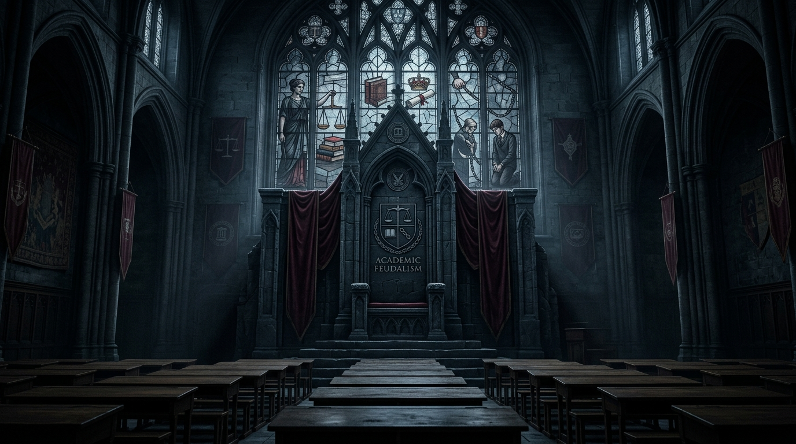
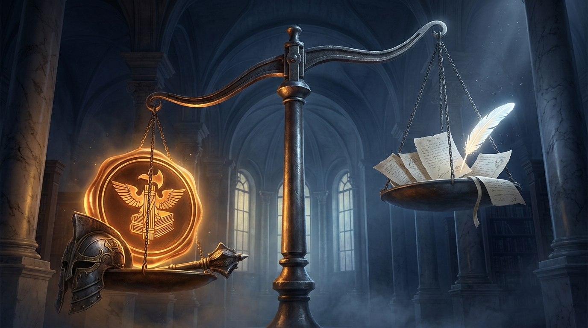
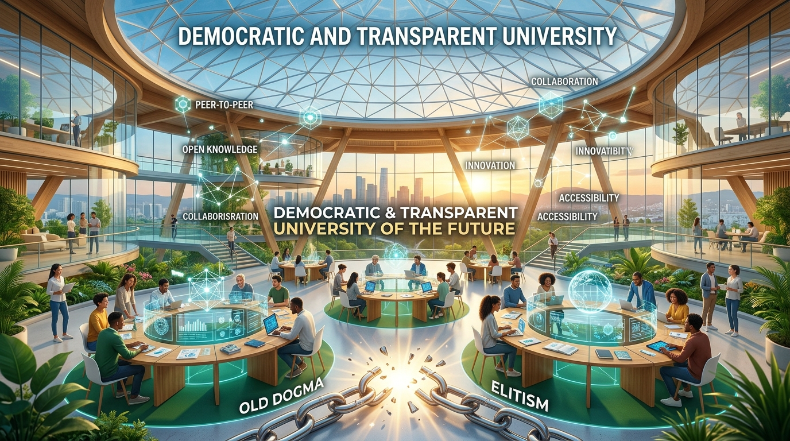

<div align="center">

# Akademik Feodalizm ve Güç Asimetrisi
### Yapısal Çöküş, Kuramsal Analiz ve Bütüncül Çözüm Manifestosu

[](https://github.com/arch-yunus/akademik-feodalizm/actions/workflows/validate.yml)
[](LICENSE)
[](index.html)
[](RAPOR_2026.md)

<br/>



<br/>

> *"Bir kurumda denetim ve hesap verebilirlik mekanizmaları ortadan kalktığında, oradaki bilgi üretimi kaçınılmaz olarak yerini feodal bir sadakat, biat ve tahakküm hiyerarşisine bırakır."*

</div>

---

## 📑 İçindekiler Tablosu

1. [Genel Bakış ve Problem Tanımı](#-genel-bakış-ve-problem-tanımı)
2. [Kuramsal Çerçeve ve Düşünürler Arşivi (12 Filozof/Sosyolog)](#-kuramsal-çerçeve-ve-düşünürler-arşivi)
3. [Sorunun Anatomisi: 6 Yapısal Boyut](#-sorunun-anatomisi-6-yapısal-boyut)
4. [Karşılaştırmalı Yükseköğretim Güç Matrisi](#-karşılaştırmalı-yükseköğretim-güç-matrisi)
5. [En İyi Sistem Hangi Ülkede ve Nasıl Sağladılar? (Hollanda & İskandinavya Modeli)](#-en-iyi-sistem-hangi-ülkede-ve-nasıl-sağladılar)
6. [Bütüncül Reform Paketi ve Somut Yasa Taslağı Önerisi](#-bütüncül-reform-paketi-ve-somut-yasa-taslağı-önerisi)
7. [Dilekçe Şablonları ve Hak Arama Kütüphanesi](#-dilekçe-şablonları-ve-hak-arama-kütüphanesi)
8. [Dizin Yapısı ve Belge Kütüphanesi](#-dizin-yapısı-ve-belge-kütüphanesi)
9. [Veri Doğrulama ve Yerel Portal Çalıştırma](#-veri-doğrulama-ve-yerel-portal-çalıştırma)
10. [Katkıda Bulunma ve Lisans](#-katkıda-bulunma-ve-lisans)

---

## 🌐 İnteraktif Veri, Test ve Analiz Portalı

Bu depoda yer alan analitik araçları, risk testini ve dilekçe üreticisini kullanmak için **[`index.html`](index.html)** portalını ziyaret edebilirsiniz:

- **Fakülte Feodalizm Risk Testi:** Bölümünüzdeki mobbing ve feodalizm riskini hesaplayan 5 soruluk interaktif simülatör.
- **Canlı Dilekçe Taslağı Üretici:** Sınav kâğıdı, barem inceleme ve bağımsız dış jüri talebi için anında dilekçe oluşturma.
- **Karşılaştırmalı Ülke Radarı:** Türkiye, ABD, Almanya, İngiltere, Hollanda, İskandinavya, Japonya ve Fransa modelleri.
- **Trend Grafikleri:** 2018–2025 şikâyet, takipsizlik ve AÖF sığınma oranları.

---

## 🔍 Genel Bakış ve Problem Tanımı

Modern üniversite ideali, Aydınlanma'dan bu yana **hakikatin arandığı, eleştirel aklın işletildiği, unvan ve statüden bağımsız argümanların çarpıştığı özgür bir kamusal alan** olarak tasavvur edilmiştir. Ancak günümüz Türkiye yükseköğretim sisteminde ve benzeri otoriter/bürokratik yapılarda üniversite; orta çağ lonca ve derebeylik düzeninin modern kanun maddeleriyle (2547 ve 657) tahkim edilmiş bir versiyonuna dönüşmüştür.

### Temel Kriz Göstergeleri:
* **Ölçme ve Değerlendirmede Mutlak Keyfiyet:** Sınav kâğıtlarının nesnel baremler olmaksızın, keyfi biçimde notlandırılması ve öğrencinin kendi kâğıdını inceleme hakkının "hocalık onuru" bahanesiyle engellenmesi.
* **%93.4'lük İdari Cezasızlık Oranı:** Yapılan öğrenci şikâyetlerinin aynı fakültedeki meslektaşlardan oluşan kurullara havale edilmesi sonucu sistematik olarak örtbas edilmesi.
* **Akademik Angarya ve Hayalet Yazarlık:** Lisansüstü öğrencilerin ve genç araştırmacıların emeğinin, tezlerinin ve makalelerinin kürsü sahipleri tarafından zorla gasp edilmesi (*coercive / gift authorship*).
* **50/d Kadro Güvencesizliği:** Araştırma görevlilerinin iş güvencesizliği tehdidiyle şahsi hizmetkârlığa mahkûm edilmesi.
* **Sistemsel Emniyet Vanaları ile Öfke Sönümleme:** Haksızlığa uğrayan öğrencinin hakkını aramak yerine Açıköğretim (AÖF), af kanunları veya sessiz terk mekanizmalarıyla sistem dışına itilmesi.

---

## 📖 Kuramsal Çerçeve ve Düşünürler Arşivi

Akademik tahakküm, bilgi tekeli ve kurumsal yozlaşma olguları dünya düşünce tarihinin önde gelen düşünürleri tarafından farklı boyutlarıyla analiz edilmiştir:

```text
┌──────────────────────────────────────────────────────────────────────────────────┐
│                           KURAMSAL PERSPEKTİF MATRİSİ                            │
├───────────────────────┬──────────────────────────┬───────────────────────────────┤
│ DÜŞÜNÜR               │ ESER                     │ TEMEL KAVRAM / ELEŞTİRİ       │
├───────────────────────┼──────────────────────────┼───────────────────────────────┤
│ Max Weber             │ Bürokrasi ve Otorite     │ Bürokratik Kast Zırhı         │
│ Immanuel Kant         │ Aydınlanma Nedir?        │ Kendi Aklını Kullanma Korkusu │
│ Jürgen Habermas       │ İletişimsel Eylem        │ Tahakkümsüz Kamusal Alan      │
│ Pierre Bourdieu       │ Homo Academicus          │ Simgesel Şiddet & Akademik Kast│
│ Michel Foucault       │ Hapishanenin Doğuşu      │ Kapalı Devre Gözetim & Disiplin│
│ Paulo Freire          │ Ezilenlerin Pedagojisi   │ Bankacı Eğitim & Gardiyanlık  │
│ Antonio Gramsci       │ Hapishane Defterleri     │ Hegemonya & Geleneksel Aydın  │
│ Edward Said           │ Entelektüel              │ Mikro-Alanda Despotlaşma      │
│ Karl Marx             │ Yabancılaşma El Yazmaları│ Akademik Emeğin Gaspı         │
│ Friedrich Nietzsche   │ Eğitim Kurumları Üzerine │ Memur Yetiştirme Fabrikası    │
│ Ivan Illich           │ Okulsuz Toplum           │ Diplomanın İtaat Belgesi Oluşu│
│ Byung-Chul Han        │ Psikopolitika            │ İçselleştirilmiş Şiddet/Tükeniş│
└───────────────────────┴──────────────────────────┴───────────────────────────────┘
```

Ayrıntılı felsefi ve sosyolojik metinler için [`alintilar-ve-dokumanlar/burokratik-tahakkum-literaturu.md`](alintilar-ve-dokumanlar/burokratik-tahakkum-literaturu.md) dosyasını inceleyebilirsiniz.

---

## 🧬 Sorunun Anatomisi: 6 Yapısal Boyut

<div align="center">



</div>

1. **Hukuki ve İdari Dokunulmazlık Zırhı:** 2547 s.K. m. 53/C (*men-i muhakeme*) ve 657 ile sağlanan yargısal dokunulmazlık. ([Detaylı Analiz 02](analizler/02_turkiyede-2547-zirhi-ve-cezasizlik.md))
2. **Ölçme ve Değerlendirmede Mutlak Keyfiyet:** Baremsiz sınavlar ve itirazın kâğıdı okuyan aynı hocaya gönderilmesi açmazı.
3. **Kapalı Devre Soruşturma:** %93.4'lük meslektaş aklama ve cezasızlık oranı. ([İstatistiksel Rapor](RAPOR_2026.md))
4. **Akademik Angarya ve Hayalet Yazarlık:** 50/d kadro şantajı ve genç akademisyen sömürüsü. ([Detaylı Analiz 07](analizler/07_asistanlik-ve-arastirma-gorevlisi-somurusu.md))
5. **Psikolojik Şiddet ve Öğrenilmiş Çaresizlik:** *Gaslighting*, akademik depresyon ve intihar vakaları. ([Detaylı Analiz 05](analizler/05_psikopolitika-ve-ogrenilmis-caresizlik.md))
6. **Sosyal Emniyet Sübvansiyonları (Tahliye Vanaları):** AÖF, periyodik aflar ve KYK ile öfke sönümleme. ([Detaylı Analiz 03](analizler/03_sosyal-tahliye-vanalari-aof-ve-kyk.md))

---

## ⚖️ Karşılaştırmalı Yükseköğretim Güç Matrisi

| Ülke / Model | Hukuki Statü & İş Güvencesi | Güç Asimetrisi Skoru (1-10) | Şikâyet & Denetim Mekanizması | Cezasızlık Oranı (%) | Öfke / Gerilim Tahliye Vanaları |
| :--- | :--- | :--- | :--- | :--- | :--- |
| **Türkiye (2547 Modeli)** | **657 & 2547 Memur Zırhı:** Yetersizlikten görevden alma imkânsız. | **9.2 / 10** (Aşırı Yüksek) | **Kapalı Devre:** Fakülte içi meslektaş ataması; harici ombudsman yok. | **%93.4** | **Yüksek:** AÖF, periyodik aflar, kesintisiz KYK kredisi. |
| **Hollanda & İskandinavya** | **Demokratik Kamu Sözleşmesi:** Şeffaf liyakat ve hesap verebilirlik. | **1.5 / 10** (Yatay ve Eşitlikçi) | **Ulusal Bağımsız Ombudsman & Sınav Temyiz Kurulu (CBE):** Dış yargıç denetimi. | **%6.8** | **Gereksiz:** Sistem şeffaf ve adil işlediği için yapay vanalara ihtiyaç yok. |
| **Almanya (Kıta Avrupası)** | **Beamte (Devlet Memuru):** W2/W3 Profesörlük, idari özerklik. | **6.2 / 10** (Orta Düzey) | **Zweitprüfer & İdare Yargısı:** Çift okuyucu zorunlu; İdare Mahkemesi not düzeltir. | **%45.2** | **Yüksek:** Harçsız kamu eğitimi, BAföG desteği, serbest üniversite geçişi. |
| **Birleşik Krallık (Regüle Piyasa)** | **Sözleşmeli Akademik Kadro:** 1988'de tenure kaldırıldı; REF/TEF odaklı. | **4.0 / 10** (Düşük) | **External Examiner & OIAHE:** Sınavlar dış hakem onaylı; bağımsız hakem ofisi. | **%29.5** | **Orta:** Gelire endeksli kredi; modül tamamlama esnekliği. |
| **ABD (Piyasa/Tenure)** | **Tenure vs. Adjunct:** Kutuplu istihdam; kadrolu korunaklı, sözleşmeli güvencesiz. | **4.5 / 10** (Orta-Düşük) | **Ombuds Office & Federal Dava:** Title IX soruşturması, sivil tazminat davaları. | **%38.0** | **Çok Düşük:** Silinemez öğrenci kredisi borçları; okuldan atılma iflas demektir. |
| **Japonya (Koza Modeli)** | **Ulusal Üniversite Statüsü:** Fiili ömür boyu istihdam geleneği. | **8.6 / 10** (Yüksek) | **Pawa-Hara Masaları:** Şikâyet masaları var ancak sosyal baskı nedeniyle atıl. | **%81.0** | **Orta:** Kurumsal işe alım döngüsü (Shinsotsu); akademik alanı sessizce terk. |

---

## 🏆 En İyi Sistem Hangi Ülkede ve Nasıl Sağladılar?

<div align="center">



</div>

Dünya genelinde akademik özgürlük ile öğrenci haklarını en kusursuz dengeleyen yapı **Hollanda ve İskandinav Ülkeleri (Danimarka, İsveç, Norveç, Finlandiya)** modelidir.

1. **Danimarka Yükseköğretim Ombudsmanlığı (*Uddannelsesombudsmanden*):** Rektör ve dekanlardan bağımsız, öğrenci şikâyetlerinde hocayı doğrudan görevden alabilen Ulusal Ombudsmanlık.
2. **Hollanda CBE Sistemi (*College van Beroep voor de Examens*):** Yargıç ve bağımsız akademisyenlerden oluşan, hocanın not takdirini resen iptal edip notu düzelten Sınav Temyiz Kurulu.
3. **İsveç HAN Kurulu (*Högskolans Avskiljande Nämnd*):** Meslektaş dayanışmasını engellemek için yüksek yargıç başkanlığında çalışan Ulusal İhraç Kurulu.
4. **Çift Körleme & İsimsiz Sınav (*Double-Blind Grading*):** Sınavlarda karekod kullanımı ve iki bağımsız değerlendirici zorunluluğu.

Ayrıntılı inceleme için [`mevzuat-arsivi/nl-dk-ombudsmanlik-ve-cbe-mevzuati.md`](mevzuat-arsivi/nl-dk-ombudsmanlik-ve-cbe-mevzuati.md) sayfasına bakabilirsiniz.

---

## 🛠️ Bütüncül Reform Paketi ve Somut Yasa Taslağı Önerisi

Türkiye yükseköğretim sistemindeki feodal tahakkümü sona erdirmek için hazırlanan **5 Maddelik Kanun Teklifi**:

1. **Madde 1:** İsimsiz sınav (karekod) ve 24 saat içinde dijital barem ilan zorunluluğu.
2. **Madde 2:** Sınav itirazlarının kâğıdı okuyan hocaya değil, 3 kişilik dış bağımsız hakem heyetine verilmesi.
3. **Madde 3:** 2547 sayılı Kanun Madde 53/C'nin (*Men-i Muhakeme*) kaldırılarak doğrudan genel savcılık yolunun açılması.
4. **Madde 4:** TBMM Kamu Denetçiliği bünyesinde Yükseköğretim Başdenetçiliği ve yasal *Misilleme Yasağı (Anti-Retaliation)* getirilmesi.
5. **Madde 5:** Lisansüstü tez yayınlarında öğrencinin birinci isim hakkı ve hayalet yazarlık yapan hocanın intihalden unvanının alınması.

Kanun gerekçeleri ve tam metin için: [`analizler/06_kapsamli-reform-ve-yasa-taslagi-onerisi.md`](analizler/06_kapsamli-reform-ve-yasa-taslagi-onerisi.md).

---

## 📝 Dilekçe Şablonları ve Hak Arama Kütüphanesi

Öğrenciler ve araştırmacılar için hazırlanmış hukuken geçerli resmi dilekçe taslakları:

- 📄 [`01_sinav-kagidi-ve-barem-inceleme-talebi.md`](dilekce-sablonlari/01_sinav-kagidi-ve-barem-inceleme-talebi.md)
- 📄 [`02_bagimsiz-dis-juri-itiraz-dilekcesi.md`](dilekce-sablonlari/02_bagimsiz-dis-juri-itiraz-dilekcesi.md)
- 📄 [`03_akademik-mobbing-ve-gorevi-kotuye-kullanma-sikayeti.md`](dilekce-sablonlari/03_akademik-mobbing-ve-gorevi-kotuye-kullanma-sikayeti.md)
- 📄 [`04_tez-danismani-degisikligi-talep-dilekcesi.md`](dilekce-sablonlari/04_tez-danismani-degisikligi-talep-dilekcesi.md)
- 📄 [`05_savcilik-suc-duyurusu-taslagi.md`](dilekce-sablonlari/05_savcilik-suc-duyurusu-taslagi.md)

---

## 📁 Dizin Yapısı ve Belge Kütüphanesi

```text
├── assets/images/                                    # Yüksek Çözünürlüklü Bannerlar & Görseller
│   ├── hero-banner.jpg                               # Ana Başlık Banner'ı
│   ├── power-asymmetry-banner.jpg                    # Güç Asimetrisi Görseli
│   └── democratic-reform-banner.jpg                  # Demokratik Üniversite Görseli
├── dilekce-sablonlari/                               # Hukuken Geçerli Resmi Dilekçe Şablonları
│   ├── 01_sinav-kagidi-ve-barem-inceleme-talebi.md
│   ├── 02_bagimsiz-dis-juri-itiraz-dilekcesi.md
│   ├── 03_akademik-mobbing-ve-gorevi-kotuye-kullanma-sikayeti.md
│   ├── 04_tez-danismani-degisikligi-talep-dilekcesi.md
│   └── 05_savcilik-suc-duyurusu-taslagi.md
├── index.html                                        # İnteraktif Web Portalı & Risk Testi
├── RAPOR_2026.md                                     # Otomatik İstatistiksel Analitik Rapor
├── KATKI.md                                          # Katkı Kılavuzu ve Araştırma Etiği
├── LICENSE                                           # MIT Lisansı
├── .github/workflows/validate.yml                   # Otomatik Veri Doğrulama CI
├── scripts/
│   ├── generate_report.py                            # Rapor Üretici Betik
│   └── validate_data.py                              # JSON/CSV Doğrulama Betiği
├── veriler/
│   ├── ulke-akademik-mevzuatlari.json                # Karşılaştırmalı ülke parametreleri
│   ├── sorusturma-sonuclari-ve-ihrac-oranlari.csv    # Soruşturma ve cezasızlık istatistikleri
│   ├── ogrenci-terk-ve-af-istatistikleri.csv         # Terk, AÖF ve af verileri
│   └── universite-akademik-mobbing-ve-intihar-kronolojisi.csv # Olay kronolojisi
├── alintilar-ve-dokumanlar/
│   ├── burokratik-tahakkum-literaturu.md             # Kuramsal metinler ve sosyolojik analizler
│   ├── ogrenci-dilekce-ornekleri-ve-akibeti.md        # Anonimleştirilmiş dilekçe vakaları
│   └── emsal-idare-mahkemesi-kararlari.md            # Danıştay ve İdare Mahkemesi içtihatları
├── analizler/
│   ├── 01_kursu-derebeyligi-ve-feodal-iliskiler.md   # Kürsü feodalizminin anatomisi
│   ├── 02_turkiyede-2547-zirhi-ve-cezasizlik.md       # 2547/657 zırhı ve kapalı devre kurullar
│   ├── 03_sosyal-tahliye-vanalari-aof-ve-kyk.md       # Emniyet vanaları ve öfke sönümleme
│   ├── 04_anglosakson-ve-kita-avrupasi-kiyaslamasi.md# Küresel modellerin karşılaştırması
│   ├── 05_psikopolitika-ve-ogrenilmis-caresizlik.md   # Gaslighting, tükenmişlik ve psikolojik şiddet
│   ├── 06_kapsamli-reform-ve-yasa-taslagi-onerisi.md # Somut kanun teklifi maddeleri
│   ├── 07_asistanlik-ve-arastirma-gorevlisi-somurusu.md # 50/d kadro güvencesizliği ve sömürü
│   └── 08_juri-ve-akademik-yukselme-yozlasmasi.md     # Adrese teslim kadro ve ahbap-çavuş jürileri
└── mevzuat-arsivi/
    ├── tr-kanun-2547-ve-disiplin-yonetmelikleri.md   # Türkiye yükseköğretim mevzuatı
    ├── abd-title-ix-ve-ombudsmanlik-yapisi.md        # ABD Title IX, FERPA ve Ombudsmanlık
    ├── de-hochschulrahmengesetz.md                   # Almanya HRG ve Prüfungsrecht
    └── nl-dk-ombudsmanlik-ve-cbe-mevzuati.md         # Hollanda & Danimarka mevzuat arşivi
```

---

## 🧪 Veri Doğrulama ve Yerel Portal Çalıştırma

Veri setlerinin bütünlüğünü ve şema geçerliliğini doğrulamak için:

```bash
python scripts/validate_data.py
```

Rapor üretmek için:

```bash
python scripts/generate_report.py
```

İnteraktif web portalını yerel tarayıcınızda açmak için:

```bash
python -m http.server 8000
```
Tarayıcınızda `http://localhost:8000` adresine gidin.

---

## 🤝 Katkıda Bulunma

Ayrıntılı kurallar, veri formatlama şablonları ve araştırma etiği için lütfen [KATKI.md](KATKI.md) dosyasını inceleyiniz.

---

## 📄 Lisans

Bu araştırma projesi [MIT Lisansı](LICENSE) kapsamında açık kaynak olarak yayımlanmaktadır.